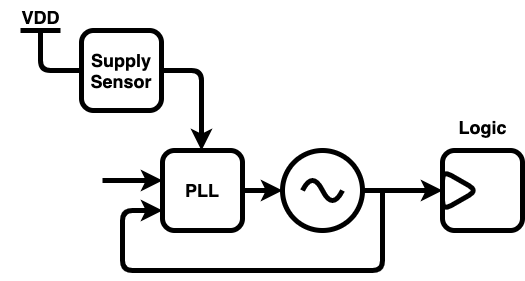

---
title: TEMPLATE TITLE
author:
  - name: Dan Fritchman \& Wahid Rahman
    affiliation: University of California, Berkeley
    location: Berkeley, Ca
    email: \{dan_fritchman,wahid.rahman\}\@berkeley.edu
numbersections: yes
lang: en
abstract: |
    (This is worded more like an intro, probably make it more concise for the abstract.) Adaptive clock generation techniques have emerged in recent generations of high-performance SoCs for mitigation of timing failures due to transient supply voltage droops. Rather than design-in timing margin via either (a) increased supply voltage, (b) improved supply-distribution, or (c) reduced supply noise, adaptive-clock systems instead detect transient supply events and temporarily reduce their clock frequency. Works such as [4], [5], and [6] include a discrete adaptive clock distribution (ACD) circuit, inserted in-line after a typical PLL. Other works such as [1], [2], and [3] instead utilize adaptive PLLs, which directly update their oscillator frequency following supply-droop events. While adaptive clocking has been shown possible for analog PLLs in [3], its cost of implementation is far lower for digital PLLs such as [1] and [2]. Such all-digital PLLs are further desirable for their small area, portability, and streamlined circuit design process. This work compares ACD and PLL-based means of adapting digital clock frequency to transient supply-voltage droops, using [1] and [4] as seminal examples of each. Finally we present the design of an adaptive all-digital PLL with sub-cycle reaction time which avoids many of the trade-offs cited in prior works [4], [5], and [6].
header-includes: |
  \usepackage{booktabs}

...

---

# Introduction 

Adaptive clock generation techniques have emerged in recent generations of high-performance SoCs for mitigation of timing failures due to transient supply voltage droops. Rather than design-in timing margin via either (a) increased supply voltage, (b) improved supply-distribution, or (c) reduced supply noise, adaptive-clock systems instead detect transient supply events and temporarily reduce their clock frequency. Works such as [4], [5], and [6] include a discrete adaptive clock distribution (ACD) circuit, inserted in-line after a typical PLL. Other works such as [1], [2], and [3] instead utilize adaptive PLLs, which directly update their oscillator frequency following supply-droop events. While adaptive clocking has been shown possible for analog PLLs in [3], its cost of implementation is far lower for digital PLLs such as [1] and [2]. Such all-digital PLLs are further desirable for their small area, portability, and streamlined circuit design process. 

This work compares ACD and PLL-based means of adapting digital clock frequency to transient supply-voltage droops, using [1] and [4] as seminal examples of each. Finally we present the design of an adaptive all-digital PLL with sub-cycle reaction time which avoids many of the trade-offs cited in prior works [4], [5], and [6].

# Adaptive Clocking Schemes 

Adaptive clocking systems include two fundamental components:

* (a) A *power-supply sensor*, which measures and reports transient droops in supply voltage, and
* (b) A *clock period actuator*, which modulates the system clock period in response to reports from the power-supply sensor

Additional logic or circuitry then manages frequency recovery from these supply-induced slow-downs. 

Adaptive Clock Distribution (ACD) and PLL-based systems differ in their implementation of component (b), the clock-period actuator. ACD-based systems extend their clock period via a discrete ACD circuit, placed in-line between the PLL output clock *pclk* and the global logic clock *gclk*, as in  @fig:acd below.

{#fig:acd}

Adaptive PLL systems, in contrast, directly incorporate supply-droop information into their oscillator frequency, as in @fig:pll. 

{#fig:pll}

Supply-droop signals are ideally fed directly into the PLL's oscillator-frequency control, extending its period essentially immediately. In state of the art adaptive PLLs this actuation latency is on the order of a few clock cycles. Logic elsewhere in the PLL then ensures continued closed-loop operation, and later manages recovery to the oscillator's original frequency. 

This work compares ACD and PLL-based *clock-period actuators*. While power-supply sensor design is not examined in depth, we briefly cover the role of sensors to our comparisons in section (whatever). 

# Post-PLL Modulation

\@wahid
Discuss \cite{wilcox2015}.

# Direct modulation of PLL

\@wahid
Discuss \cite{hashimoto2018}.

PLL characteristics that help this:

* Instant frequency change
* Digitally manageable recovery
* Knowledge of control versus frequency info, i.e. calibration data 
* Instantly reconfigurable loop filter

# Comparison of ACD and PLL Based Actuators

## The Role of Power-Supply Sensors 

Supply sensors may be asynchronous or clocked. Generally they must operate at frequencies far greater than the maximum expected supply-droop frequency, typically closer to the digital clock frequency. Both voltage-based and time-based sensors have been reported in high-performance adaptive clocking systems. These sensors form a low-resolution supply-measurement ADC, often with non-linear thresholds dictated by logic timing thresholds. Sensor designs include trade-offs between accuracy, speed of response, and digital integrate-ability, i.e. the amount of highly custom and analog circuitry which much be designed and integrated in an otherwise digital system. 

This work compares ACD and PLL-based *actuators*, independent of power-supply sensor. Designs of either popular class of sensor (voltage and time-based) are compatible with both classes of actuator examined here. The comparisons in this work proceed under the realizations that ACD and PLL systems have no inherent advantages with regards to:

* (a) Latency in response to similar power-supply sensors, or
* (b) Compatibility with similar diversity of power-supply sensors, or
* (c) Requirements for the performance of their power-supply sensors

In short, any sensor which works for an ACP should work equally well for an adaptive PLL. For sake of our comparisons, we assume a supply-sensor with (FIXME: some feature list of thresholds, latency, etc.). 

## Comparison Criteria 

The most obvious downside to the ACD-based systems is the inclusion of the ACD circuit itself. While low-cost variants using simple frequency-dividers have been proposed, these systems generally lack the frequency resolution to prevent significant performance degradations from minor supply disturbances. For example down-shifting from frequency *f* to frequency *f/2* upon a supply-droop event will, in general, halve the digital logic performance until the event can be confidently deemed complete. Upon completion, a single step directly back to *f* is the only available frequency-recovery trajectory. 

Higher resolution ACD systems such as [@wilcox2015] instead use a combination of delay-locked loops (DLLs) with phase rotation and/or interpolation to extend the clock period. These systems can, in principle, have period resolution of a single delay-stage delay (or less). Their primary cost is power. The DLL, phase rotation, and its accompanying control logic all operate at the logic-clock frequency. Worse, these circuits must be active at essentially all times; disabling them greatly expands the latency of the period-actuator. 

Adaptive PLL systems offer a means to remove the high-power ACD circuit altogether, by feeding their supply-sensor data near-directly into their oscillator frequency-control. This can result in a material savings of power, on the order of magnitude of the PLL itself. Digital PLLs with digital controls and ring oscillators have essentially unlimited bandwidth from frequency-control-code changes to their output frequency. Response-times to supply droops of only a few clock cycles have been reported, such as in [@hashimoto2018]. (We believe there is potential to reduce this latency to less than one clock cycle.) A digital PLL's highly configurable control loop also provides ample mechanisms to temporarily modify its loop dynamics, and to apply frequency-recovery schemes of near-arbitrary shape and duration. 

Many of the costs of adaptive PLL systems are instead borne at design-time. Incorporating the power-supply sensor feedback inside of the PLL feedback loop complicates its dynamics and overall design. Oscillator requirements for example those for frequency range and resolution, which typically dictate PLL power through their impact on noise and stability, are further complicated by the requirement for fast frequency shifting. 

## Comparison Methodology

The relative advantages of ACD and PLL systems manifest at different times. ACD-based systems reduce design-time complexity in exchange for run-time power and area. Adaptive PLLs, in contrast, can principally be designed at lower power, but with a more constrained, sensitive design process. Our comparison then proceeds along two lines:

* First, we examine the power and area requirements for an ACD-based actuator similar to that of [@wilcox2015].
* Second, we present the design of an adaptive PLL similar to @[hashimoto2018], which we expect will alleviate many of the prominent design-time constraints. 
* Our results then compare both the realized performance, power, and area of this PLL, along with its design process, flexibility, and portability to new process technologies. 

## Conclusion

This work compares the costs and effectiveness of ACD and PLL based adaptive clocking systems. ACD-based systems reduce design-time complexity in exchange for run-time power and area. We first examine the required power and area of state of the art ACD actuators. We then present the design of a digital adaptive PLL which removes the need for an ACD-based actuator, along with many of the undesirable trade-offs common in adaptive PLL design.

# References

---
nocite: '@*'
---
