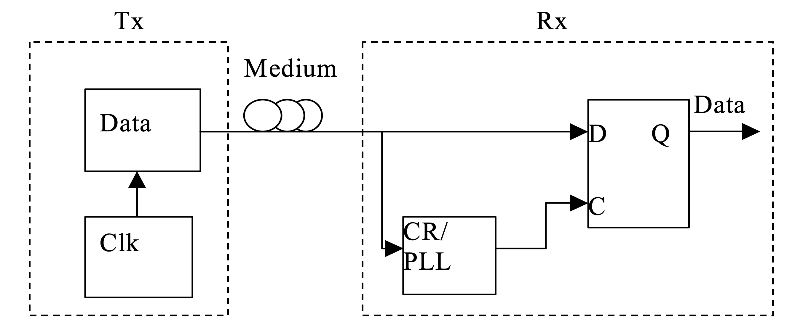

# Digital PLL Ideas That Work (And Don't)

## Outline

* A spectrum of digital PLL ideas, from mainstream to totally crazy 
* Why the analog ones won't seem to go away 
* What really makes these things "digital"? 
  * Signals that swing between VSS and VDD? 
  * Using CMOS logic circuits? 
  * Standard-cell layout style? 
  * Digital-design methodology? 
  * All (or none) of the above?
* What's the point of that digital-iness in the first place? 

This is a survey of digital PLL ideas that I find good, bad, or just interesting. We'll primarily focus on clock generation for SoCs and other synchronous digital logic, while occassionally nodding to other uses of PLLs and their differences. A few related themes run throughout: (a) why won't these old analog PLLs go away? (b) what really makes these circuits digital in the first place? and (c) whatever that is, can we just get the good parts? 

## Intro: Jitter, and Our Failures Talking About It 

The whole point of a clock-generator is providing a stable time-base for a synchronous system. Beyond than the suite of metrics that characterize *every* class of circuit (power, area, delays, ranges, flexibility, etc.), clock generators really have one unique metric: their timing noise. 

Problem is, time and noise are two ideas we have a tough time merging. And different classes of digital systems - the circuits *using* the clock - depend on very different quantities which tend to get lumped together under the single term *jitter*. There are at least two such quantities (not metrics - altogether different quantities) listed in Table 1 (and a third which is often listed, and rarely useful). 

Probably the best gentle-intro to these quantities comes from Gerry Talbot & Co's work from [ITC 2004](https://ieeexplore-ieee-org.libproxy.berkeley.edu/stamp/stamp.jsp?tp=&arnumber=1387390) and [DesignCon 2005](https://citeseerx.ist.psu.edu/viewdoc/download?doi=10.1.1.134.398&rep=rep1&type=pdf). They (among others) make a valuable analogy between these time-quantities and positional ones. Phase is position, frequency (or period) is velocity, and... we'll talk about that third row, which maps onto acceleration. 

| Quantity                | Analogy      | Who Cares?                                     |
| ----------------------- | ------------ | ---------------------------------------------- |
| Phase Jitter            | Position     | Data Converters, SERDES, Wireless Transceivers |
| Period Jitter           | Velocity     | Synchronous Digital Logic                      |
| "Cycle to Cycle" Jitter | Acceleration | *??????*                                       |

Notably in these analogies: 

* Although we often state them as RMS or peak values, *all three of these quantities are time-sequences*. 
* Like the positional analogies, phase, period, and cycle-to-cycle jitter are differentially related. Frequency (period) is the derivative of phase, and "cycle to cycle" (whatever that is) is the derivative of frequency. 
* Unlike in the positional analogies, the units of the three jitter quantities are all the same: time. Generally values of all three are reported in time-units, e.g. picoseconds RMS. 

 *[Talbot, DesignCon 2005](https://citeseerx.ist.psu.edu/viewdoc/download?doi=10.1.1.134.398&rep=rep1&type=pdf)* 

The real point here is the **Who Cares** column. Notably different classes of circuits care entirely about one or the other of phase and period jitter - and rarely both. Most of the analog-ier classes care about phase, while digital-ier stuff cares about period. (We'll shortly discuss why.) 

And the question-marks in our bottom-right entry are very sincere: I'm yet to find an electronic system that cares one bit about cycle-to-cycle jitter. This is a quantity that sparks a wide divide between chip and system designers. Discrete clock-sources tend to report cycle-to-cycle jitter (generally without also including either phase or period). Integrated PLL designers, in contrast, rarely report (or even measure) this quantity at all. The case for reporting it has something to do with the stability of measuring it, or the repeatability of measuring it, or some argument I hear every so often (and never buy). More relevant: systems fail when they misunderstand or misplace these quanties. [Talbot & co](https://citeseerx.ist.psu.edu/viewdoc/download?doi=10.1.1.134.398&rep=rep1&type=pdf) show a number of examples of just how different 1ns cycle-to-cycle and 1ns of phase jitter can be. 

### Why Phase vs Period 

Some of these systems may seem unusually similar to have such different sensitivities. Wireline serial-links (SERDES) and synchronous digitial logic appear particularly similar. In both cases, a transmitter ("launch flop") generates some data, it propagates through a medium (logic gates, or a transmission-line channel), and another similar clock at a receiver ("capture flop") samples it. 

The difference boils down to correlation between the transmitter and receiver. In synchronous logic, "the same" clock times both. These *launch* and *capture* clocks may be separated by clock buffers and distribution networks, but noise *from the clock source* shows up at both. Timing success or failure is only dependent on the *time difference* between any two edges, i.e. the period and its period jitter. 

*[Rahman & Fritchman, "Proceedings of Bora's Course"](https://github.com/NotReallySynthPlls/FinalReport/blob/master/conference_101719.pdf)*

In the serial link, in contrast, transmitter and receiver have related but *different clocks* - specifically from the perspective of clock-source noise. A receiver CDR PLL commonly derives (what it hopes to be) a phase-shifted replica of the TX clock. By definition this PLL has finite bandwidth, so noise on the TX clock outside this bandwidth (e.g. the immediate response to a phase step) is filtered out, mis-aligning the sampling time and increasing the BER. 

*Talbot & Co, [ITC 2004](https://ieeexplore-ieee-org.libproxy.berkeley.edu/stamp/stamp.jsp?tp=&arnumber=1387390), [DesignCon 2005](https://citeseerx.ist.psu.edu/viewdoc/download?doi=10.1.1.134.398&rep=rep1&type=pdf)*

Note the fact that TX and RX reside on separate chips doesn't (directly) matter at all. Source-synchronous inter-chip interfaces, such as those commonly used by DRAM, look much more like the synchronous logic in this respect. 

A few simple thought experiments can help tease out which sensitivity any given system has. For a system with nominal period T: 

* (1) If there's an impulsive change in period - e.g. cycle N is reduced from T to 0.9T - is cycle (N+1) any more likely to fail? 
* (2) If two consecutive periods (N-1 and N) are reduced to 0.9T, is the problem in cycle (N+1) "twice as bad" as case (1)? 

Both experiments capture the same idea: does the system integrate phase errors, or reset them at the completion of each cycle? 

Some good news: since we're focusing on SoC, processor, and logic clock-generation, we don't care much about phase jitter. These systems are only sensitive to frequency and period noise. The fact that frequency is a phase-derivative means the period-dependence adds an effective differentiator to any low-frequency noise, such as that from a VCO's flicker noise. This is a central reason why SoC-style clock generators can often stomach many of the performance-degrading design aids we'll pursue, and phase-sensitive generators can't. 

## Back to PLLs, in Analog World 

Despite the lack of overt need for locking to any particular phase, SoC clock generators are still primarily built from PLLs. In principal, these systems could use an open-loop oscillator, if we could find one with (a) sufficient stability across temperature, voltage, and any other long-term variations, (b) sufficient programmability to cover any diversity in target system frequencies, and (c) oscillated at the target system frequencies. 

We don't really have any of those. The typical SoC clock generator (shown here in analog form) uses a lower-frequency oscillator, paired with a feedback-based frequency multiplier (the PLL). Programmability is afforded via the division ratio N, assuming we can tweak any related parameters (e.g. for loop stability) along with it. All of the liabilities of feedback systems (their propensity to oscillate, intolerable analog guys talking about their phase-whatever) come along for the ride.

*Analog PLL, Courtesy Niknejad EECS 242B Lectures*

This block diagram depicts the *analog charge-pump PLL*, probably the most-used (and certainly most-taught) architecture around. The idea turning this circuit digital (or at least *more* digital) has been around for a few decades. Unlike in, say, analog signal processing, the digital hasn't secured nearly as decisive a win in this space. Why not? We can start with 

It's worth digging around which parts of the charge-pump PLL are so objectionably analog. For most folks, the ugly part is right about here: 

*From Razavi, Design of Analog CMOS Integrated Circuits*

Those charge-pump currents, resistors and caps sure ain't digital. The phase-frequency detector, in contrast, looks pretty digital already: 

*From Razavi, Design of Analog CMOS Integrated Circuits*

This is commonly known as the three-state PFD, for the simple FSM which it implements. While there are fancier PFDs to be made, that one works quite well and has long been the workhorse of most charge-pump PLLs. Every signal in here swings from VSS to VDD, and every transistor is arranged in CMOS logic gates. (Very common ones at that.) 

So, can we just replace the ugly current-source and electrical filter with a digital accumulator and call it a day? 

Not quite. The three-state PFD does have a sole analog-ish facet: its output encoding. Phase and frequency error is encoded as a *pulse width* - more specifically the difference between the two pulse widths on the *up* and *down* (pictured as QA and QB) signals.  

More generally, the charge-pump PLL does a set of domain transformations at essentially every block: 

* The PFD converts frequency and phase error into pulse-width 
* The charge pump convertes pulse-width into current
* The (shunt) loop filter converts current into voltage (generally integrating along the way)
* The oscillator converts voltage into frequency and phase

If we really want to use a traditional digital loop filert, we've got to make a set of domain-transformations that looks more like this: 

Phase and frequency are both continuous quantities. We quantize and sample the error-phase (via a time-ADC), in order to digitally filter it and transform it back to time (via the DCO). 

Both this ADC and DAC can be relatively implicit (although many PLLs design an explicit DAC, and some an explicit ADC). The ADC operates on a weird kinda quantity, attempting to digitize phase (time). While neither needs to be a world-class data converter, they nonetheless bring along many data-converter liabilities - particularly the data-converter "golden rule". 

*Range = Resolution \* LSB* 

That fundamental relationship drives most of the digital PLL's worst-kept secret. 

## The Dirty Little Secret of Digital PLLs: 

## *Analog Ones Kinda Work Better* 

This may sound controversial, but will ring true among most PLL design groups: given a set of top-level metrics - typically power and performance (noise) - more often than not, the analog loop wins. 

There's a seeming tradition among PLL design teams: when a new project starts, everybody's tired of all those analog liabilities. They hate doing layout, getting into fights with the foundry, bricking tape-outs at the last minute with bad LEFs, yada, yada, yada. Time to turn this thing digital! Design commences. But bit by bit, some digital facet holds back the performance, relative to the old version, or another group's design, or something. Little analog bits start to show up, maybe just on the margins at first. Then all over the place. There are lots of intermediate capitulations along the way, but if (often, when) the charge-pump comes back, the thing's officially analog again. 

Why does this tend to happen? I think there are a combination of real, instrinsic reasons, and some other more cultural ones. 

The intrinsic reasons start with our range-resolution trade-off: quantization error of *both* the phase-ADC and DCO-DAC contribute to timing noise. For example, imagine we need a 1-5 GHz frequency range, and manage to design a perfectly-linear 7 (binary) bit DCO. (Pretty good.) At our low frequencies, quantization error of that DCO alone generates jitter equal to 6.25% of a period. That's probably more than our digital logic wants to tolerate, and it's before we add any other noise source. 

Just about any wide-range digital PLL uses some form of *frequency banding*, offline calibration, or other frequency sub-ranging approach. The range-resolution trade-off is generally too painful for SoC-style clocks, which generally have a wide range to support a diversity of power states. Note this also means these PLLs cannot slowly walk from their min to max frequencies, without going through some form of re-training, calibration, or banding. (Granted some analog ones have the same constraint.) 

This is also why digital architectures have a sort of "well-shaped" utility versus noise performance. The lowest-performing PLLs benefit from the digital construction methods. The highest-performing PLLs for wireless applications can also disproportionally use digital techniques - but only due to their narrow frequency range. [Staszewski's pioneering digital RF PLLs](https://ieeexplore-ieee-org.libproxy.berkeley.edu/stamp/stamp.jsp?tp=&arnumber=4100882) serve as prominent examples. 

Similar range-resolution problems apply to common digital phase detectors, which we'll cover next. 

But first, the cultural factors. Designing PLLs requires a set of knowledge that, well, analog guys more commonly have. Just the feedback network design and transistor-level DCO design rules out the majority of IC designers. The charge-pump PLL has a nicely tractable analytical model, in language these folks understand. Linear frequency-domain models are well understood, and more importantly *they actually work*. University courses and books commonly offer its design as curriculum. (Notably, Berkeley's most recent *Advance Digital IC* course included the design equations and procedure for charge-pump PLLs - and then just mentioned that digital PLLs exist. This strikes me as a typical level of coverage.)

The analog skill-set applies to more than designing current-sources and filters, it also tends to manifest in what designers *won't* do, and *won't* trust. These calibration, ranging, and general behavioral mechanics commonly qualify. As our computer-architecture friends will gladly tell us, things to go catastrophically wrong tend to do so in control logic. So it is with PLLs. A common example: the hand-off between what tends to be a series of different-range phase-frequency detectors. Each digital PLL makes a set of decisions as to whether its multiple feedback loops are somehow combined, or sequentially handed off from one to the next. Behind both doors there lay some dragons. For the analog tribe, particularly behind the latter. The three-state PFD, in contrast, is really ingenious in its ability to pull the PLL into lock from essentially any state. 

## TDCs

Back to less human-contingent topics: we previewed the digital PLL's need for a phase-ADC, typically called a time to digital converter (TDC). 

(This is another circuit where we could ask: is this digital? Designers tend to spend about as much time tuning them as fine-grained voltage ADCs, so I'm not sure.) 

I find it helpful to discuss the TDC in data-converter terms, rather than digital-circuit ones. Like every other ADC, the TDC needs a reference, which tends to be the delay through some on-chip delay-cells. (These delays are then often calibrated offline.) Both the noise and quantization error of the TDC contribute to timing noise, so many digital PLLs go to great lengths to design quite elaborate ones. 

These high-resolution needs coupled with the PLL's inherent filtering effects have driven attempts at delta-sigma modulated TDCs. Mike Perrott's group at MIT, particularly keyed by Matt Straayer, have been particularly prolific on this topic. The hard part of a delta-sigma TDC is that for most of a reference period, the TDC does... well, nothing. Effective delta-sigma modulation requires bucket-brigading each cycle's quantization error over to the next. Straayer's gated-ring-oscillator TDCs attempt to do so by "freezing" the state or a ring oscillator, and allowing it to continue oscillating only for short intervals proportional to the phase error. 

[*Straayer JSSC 2009*](https://ieeexplore-ieee-org.libproxy.berkeley.edu/stamp/stamp.jsp?tp=&arnumber=4804998)

The gated-ring TDC is pretty far out there. I don't know anyone who's designed one, and doubt I know anyone who would have the guts to. But it's a good indication of the demands good PLLs place on these TDCs, and the lengths designers take to meet them. 

## Bang-Bang Control 

Rather than designing a high-resolution phase detector, many PLLs opt for the minimum phase-ADC resolution possible: a single bit. These *bang-bang* PLLs require only a single flip-flop as a phase detector, and are especially popular in receiver CDR PLLs. 

[*Xu & Abidi, TCAS 2017*](https://ieeexplore-ieee-org.libproxy.berkeley.edu/stamp/stamp.jsp?tp=&arnumber=7885515)

A classic BB-PLL (and a local favorite) is Rylyakov, Friedman, Tierno, and co's work presented at ISSC 2007. The Rylyakov PLL includes among the most-direct digital-to-frequency ring-DCO's presented, comprised of a matrix of gated-inverter cells, enabled a single cell at a time. This level of digital-iness is about where authors start invoking the  "all digital" PLL signifier. 

[*Rylyakov, Friedman, Tierno, ISSC 2007*](https://ieeexplore-ieee-org.libproxy.berkeley.edu/stamp/stamp.jsp?tp=&arnumber=4242320)

The BBPD makes a PLL implementation a whole lot easier on its face. But it comes with some real costs. Most obviously the BBPD substantially reduces the detector resolution, limiting some combination of the noise and bandwidth. It has a small locking range, generally requiring a separate frequency-control loop, which may operate in the background, or hand off to the BBPD. 

Often just as impactfully, the BBPD generally proves aways more difficult (or at least counter-intuitive) to anayze. The bang-bang phase detector has essentially infinite gain at a single phase, and zero gain at any other, rendering most linear-systems, frequency-domain, and stability analysis irrelevant. (Remember it's the analog guys who know how to design this stuff in the first place.) 

[*Xu & Abidi, TCAS 2017*](https://ieeexplore-ieee-org.libproxy.berkeley.edu/stamp/stamp.jsp?tp=&arnumber=7885515)

A number of analyses, most prominently [by Kundert, Razavi, and Jri Lee](https://kenkundert.com/docs/jssc04-09.pdf), build linear models of these bang-bang circuits. Their premise goes like so: the oscillator output will have jitter, and (maybe? hopefully?) that jitter will be roughly normally distributed. Assuming so, over many cycles the BBPD will produce an average output proportion to the jitter CDF (or at least the jitter CDF, relative to what an ideal edge "would have been"). 

The (highly counter-intuitive) conclusion is that the BBPD gain is the reciprocal of the RMS jitter.  

*[Kundert, Razavi, and Lee, JSSC 2004](https://kenkundert.com/docs/jssc04-09.pdf)*

I've never really known how far to trust this idea, and have known plenty of super-smart folks who don't buy it at all. (Including one or more of our cited authors.) The transition back-and-forth between ideal-phase and jitter-modified noisy phase seems particularly dicey. Moreover: where does this jitter estimate come from? One of the goals of creating a PLL model is *generating* these estimates for jitter. In principal the estimate is a function of the phase detector gain. 

The upside to having a linear BBPD model is also quite clear: it provides a path to a tractable analytical model of the loop's dynamics and noise. Without such a linear model, our inherently non-linear understanding of this circuit is generally only explorable through simulation. 

## "Synthesizable" (Ahem) Digital PLLs

While "all-digital" PLLs such as Rylyakov's are built essentially entirely of CMOS logic, much of their design continues to require custom-style entry methods, such as manual layout and cell selection. Rylyakov's design is described as being *"designed exclusively with standard cells - except for the tri-state inverter in the digitally-controlled oscillator"*. But it very explicitly includes some not-no-standard circuits in their phase detector: 

[*Rylyakov, Friedman, Tierno, ISSC 2007*](https://ieeexplore-ieee-org.libproxy.berkeley.edu/stamp/stamp.jsp?tp=&arnumber=4242320)

(I'm sure IBM's standard-cell library was bigger than most, but it's hard to imagine it included either of those.) 

Even setting aside the more bespoke C-Element and Mutex, Rylyakov's original point remains: many modern libraries won't include high-impedance-output circuits such as the gated inverter. Once these cells are designed (whether as part of a library or dedicated to a PLL), their combination into an oscillator generally requires careful manual layout. Non-linearities in their control versus frequency characteristic manifest as noise. Asymmetries in phase-ADCs (TDCs) have similar (or worse) effect.

Preferably, we could use popular digital-design flows - HDLs, logic synthesis, auto place-and-routed layout - to generate these "digital" circuits instead. Among the most enthusiastic and prolific researchers of such *syntethesizable* (large asterisk) PLLs has been Wei Deng of Tsinghua University, formerly Apple and Tokyo Tech. Deng's groups have published a long series of digital-PLL articles, each focused on architectural edits to aid digital-design-friendliness. 

### Injection Locking 

Deng identified that many of the non-idealities imposes by automatic layout generation could be architecturally indeminfied via *injection locking*. This technique drops the phase detector altogether, and instead injects the reference signal as a "reset" into the controlled-oscillator. Injection locking has been around as long as PLLs themselves, although less prominently in recent decades. IL-PLLs generally need a separate means of frequency-locking, typically in the form of an internal FLL. Deng's 2014 work pictured below uses a replica oscillator for this frequency-loop; many other IL-PLLs use "the" oscillator directly. 

*Deng ISSCC 2014, JSSC 2015*

Implementation of the injection-lock is relatively straightforward, for both ring and LC oscillators. A reference edge is transformed into a narrow injection-impluse, which briefly resets the oscillator phase, typically by shorting either one of its stages (or its LC tank). 

Maybe less intuitively, injection locking has a similar noise-shaping characteristic to phase-locking. Low-frequency oscillator noise is attenuated essentially to zero, as long-term variations are quickly reset by the reference. High-frequency oscillator noise is not filtered. 

### But How *Synthesizable* Is This Stuff, Really?

The design procedure described in [Deng's 2014 ISSCC paper](https://ieeexplore-ieee-org.libproxy.berkeley.edu/stamp/stamp.jsp?tp=&arnumber=6757428) and [subsequent JSSC follow-on](https://ieeexplore-ieee-org.libproxy.berkeley.edu/stamp/stamp.jsp?tp=&arnumber=6891375) shows the *synthesizability* is, well, aways from *full*: 

*Deng, ISSCC 2014*

Note two thirds of "DCO", "DAC", and "Logic" don't go through logic synthesis. They are instead written as gate-level netlists. (The title "fully synthesized" appears to mean something closer to "fully place-and-routed".) These are nonetheless probably the most digital-flow-generated PLLs I've seen. Deng's group went out of their way to generate their 2014 layout twice: once with separate, hierarchical layouts for the DCOs and DACs, and another in which everything is thrown in together. (The DCO delay cells are just "any other gate" in the layout at left.)

The need to avoid synthesis tools becomes apparent when we dig into the DCO and DAC circuits. These circuits primarily implement the frequency-control path, and really push our definitions of what makes them digital.  Coarse frequency control is performed by a NAND-gate-based DAC, driving a diode-connected output replica, and ultimately a current-starving NAND-based ring oscillator. 

(Note many of the inconvenient connections, such as the PMOS gates in the diode-connected load-NAND and ring oscillator, are either omitted or de-emphasized in grey.) 

So - *is that a digital circuit?*

Is it more or less digital than the phase-frequency detector we started with? 

It clearly creates at least one analog voltage, at the interface between the DAC and VCO. If we just called this *vctrl*, does this cease to be a digital PLL? 

The same work uses even more inventive delay-setting for its fine-frequency controls, tuning stage delays via off-path logic levels. These circuits operate more in the vein of typical DCOs, performing relatively direct digital-to-frequency conversion. But it's hard to imagine how they are immune from the random auto-generated layout placement, as in the "fully synthesized" layout style. 

### Multiplying DLLs

A similar concept to injection-locking is employed by *multiplying delay-locked loops*. Where the (non-multiplying) DLL creates a feedback-tuned delay from a reference edge, the MDLL effectively turns this delay-line into a short-term ring oscillator. The sole implementation difference from the injection-locked RO is the replacement of the shorting switch with the reference-mux. For a multiplication factor of N, this mux is set to its feedback input for (N-1) cycles, and then feeds in the reference on its Nth cycle. 

*[Helal, Straayer, Wei, Perrott, JSSC 2008](https://ieeexplore-ieee-org.libproxy.berkeley.edu/stamp/stamp.jsp?tp=&arnumber=4476488)*

The MDLL requires a similar frequency-control loop to that of the IL-PLL. Prominent examples have included the same Perrott group which introduced the gated-RO TDC:

*[Helal, Straayer, Wei, Perrott, JSSC 2008](https://ieeexplore-ieee-org.libproxy.berkeley.edu/stamp/stamp.jsp?tp=&arnumber=4476488)*

Note this MDLL includes a discrete voltage-mode DAC driving its delay-line, fairly literally patterning our domain-conversion model. 

## Further Out There: Time-Based Stuff

At this point we've seen some digital circuits that look pretty analog. Most of our digital PLLs started with the premise that a digital accumulator would be a great basis for a loop filter, and from there attempted to generate a phase-error signal compatible with one. Could we instead build a "digital" loop filter using our time-based error signals from the three-state PFD? The primary hurdle is somehow performing the integration of a pulse-width signal digitally. 

We can build such a thing by first realizing that we've had an ideal integrator lying around the PLL all along: the VCO. The conversion from frequency to phase is an ideal, mathematical integration. As long as we can measure phase at its output, we can in principal use a VCO as a voltage (or current) integrator. This is the premise behind [Zhu, Hamomolu and team's work presented at ISSCC 2016](https://ieeexplore-ieee-org.libproxy.berkeley.edu/stamp/stamp.jsp?tp=&arnumber=7418045). 

*Loop Filter from [Zhu ISSCC 2016](https://ieeexplore-ieee-org.libproxy.berkeley.edu/stamp/stamp.jsp?tp=&arnumber=7418045)*

Creating a complete PLL from the idea requires a few more bits of machinery. The loop-filter VCO-integrator is implemented pseudo-differentially, providing both a time-base for comparing phase. Oscillator control is performed in the current domain. (It's not clear why the three pink sections of this PLL diagram are called "DACs"; they convert pulse-width to current, much as does a charge pump.)

*[Zhu ISSCC 2016](https://ieeexplore-ieee-org.libproxy.berkeley.edu/stamp/stamp.jsp?tp=&arnumber=7418045)*

While Zhu's PLL re-instates the charge-pump and ends up relatively analog, in principal the loop-filter VCO's phase could instead be quantized, allowing for direct DCO control, similar to Straayer's ring TDC. Proportional control would likely require a differentiation of these counts. 

The time-based integrator is a weird PLL idea that, in all likelihood, doesn't really work. It's more interesting as a conceptual study in what's helpful about moving circuits in either direction on our analog-digital spectrum. 

## Aside: On How These Things Get Simulated 

(Coming Soon)

* Simulink 
* CppSim
* Verilog 
* SPICE

